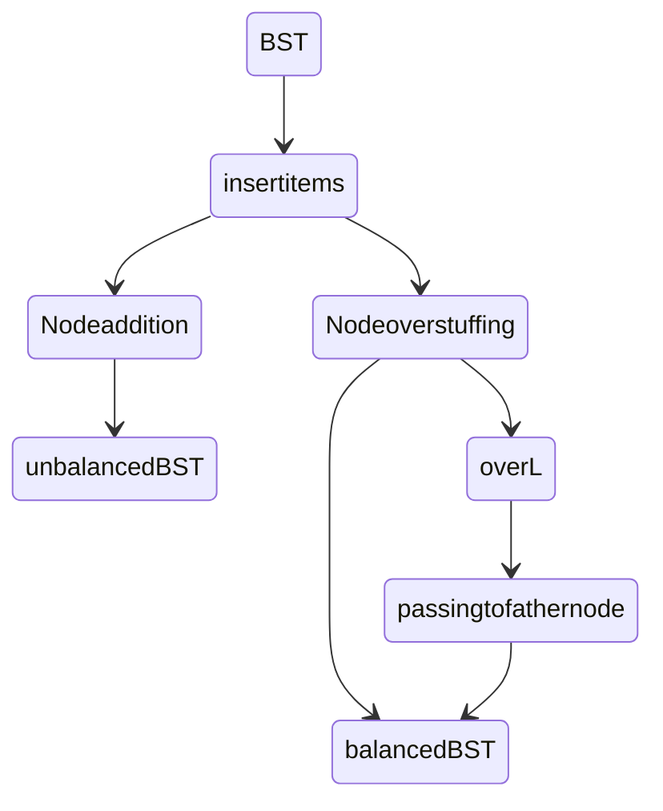
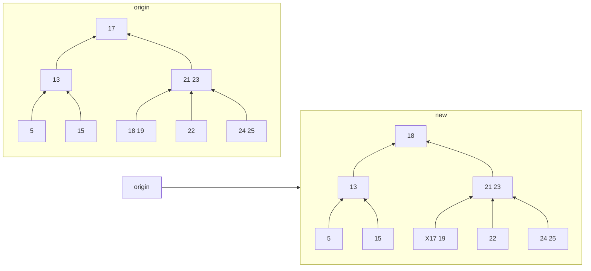

#data_structure 
## basic concepts

>[!invariants]
[[#^f85880|rules]]
All leaves must be the same distance from the source.
A non-leaf node with k items must have exactly k+1 children.

>[!定义]
B tree are also called 2-3-4 tree or a 2-4 tree(numbers refer to the possible number of a node)

## simple demo


 ```mermaid
 flowchart TB
 subgraph  origin
 direction BT
 A[2] & B[7] --> C[5]
 D[14] & E[16] -->F[15]
 C & F --> G[13]
 end
  subgraph overstuffing
  direction BT
 a1[2] & a2[7] --> a3[5]
 a4[14] & a5[16 17 18 19 20 21 22 23 24]-->a6[15]
 a3 & a6 --> a7[13]
 end
 origin -->overstuffing
```
## item add
>[!优化过度填充策略]
1.设定单个节点的item数目上限L(主要讨论L=3的情况)
2.如果某个节点的数目超过L，则将其中一个item转移至父节点
3.符合一二条则保持二叉树的基本结构特性
4.查找某个item将耗费O(L)

^f85880

>[!node splitting and transport]
若对根节点进行分裂，则所有节点向下延申一级(depth+1)
若对其他节点进行分裂，则树的高度不会发生改变

## item delete
- case1  delete α from a node with 2 or more children
● Swap the value of the successor with α.
● Then we delete the successor value


- case2 deleting from a leaf with multiple keys
●remove the item from the leaf

- case3 deleting from a leaf with multiple keys

