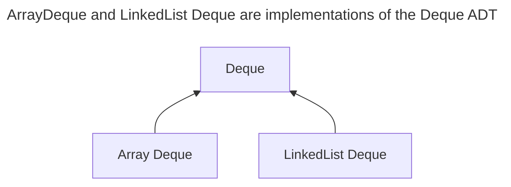
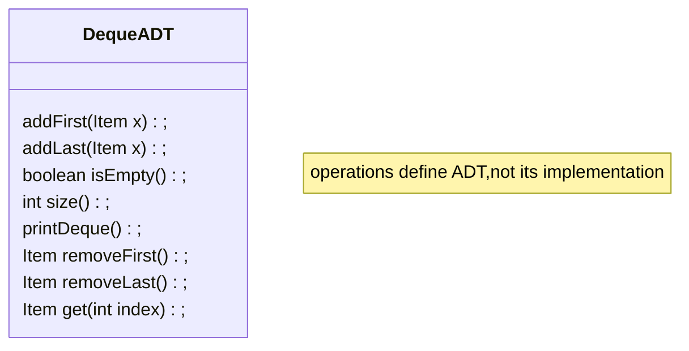

#data_structure
---
>[!Abstract Data type]
决定抽象数据类型的是其所具有的operation outside(terminal usage)，而非implementation within(constructor)
examples: [[离散集合]]




---
###　二叉树
>[!树的定义]
节点的集合，节点间存在连接，任意两节点间只有一条通路
### 根树的定义
1. 除根节点外每一个节点都只有一个父节点，且父节点为该节点到根节点通路上的第一各元素
2. 默认根节点位于树的顶部
3. 没有子节点的节点称为叶
4. 每个节点只有0或1或2个节点
#### 二叉树的特性基于根树定义 
1. 每个节点的左子树的所有节点的key都小于当前节点的值
2. 每个节点的右子树的所有节点的key都小于当前节点的值
3. 二叉树中排序是完整，可过渡，非对称的
### 二叉树的应用
1. search
```java
static BST find(BST T, Key sk) {
   if (T == null)
      return null;
   if (sk.equals(T.key))
      return T;
   else if (sk ≺ T.key)
      return find(T.left, sk);
   else
      return find(T.right, sk);
}  // MERGE SORT AND SELECTION SORT
```
2. insert
```java
static BST insert(BST T, Key ik) {
  if (T == null)
    return new BST(ik);
  if (ik ≺ T.key)
    T.left = insert(T.left, ik);
  else if (ik ≻ T.key)
    T.right = insert(T.right, ik);
  return T;  //keep the structure complete
}
```
3. delete
- no child  
***remove its father node's pointer to NULL***
- one child  
***move its father node's pointer to its child node***
- two child  
***delete its preceder or successor and copy its value to current node***
---
### 二叉树的高度（height of BST)

>[!definition]
depth:节点到根节点的通路中节点个数
height：所有叶节点的depth中的最大值

>[!两种极端结构]
[[算法分析#^19fc8e|big theta]]
[[算法分析#^581283|big O notation]] 在某种特定情况下，可以视为小于等于，所以可以存在很多值，具体描述时应当越精确越好

|结构|height（contain/find)|(find)average height|特性|
|----|----|------|-------|
|bushy|Θ(logN)|Θ(logN)|充分利用二叉树的结构特性|
|spindly|Θ(N)|Θ(N)|退化为linked list,基本丧失二叉树的特性|

***Random trees have Θ(log N) average depth and height,which means bushy trees***

>[!summary]
● Worst case Θ(N) height.
● Best case Θ(log N) height.
● Θ(log N) height if constructed via random inserts.

