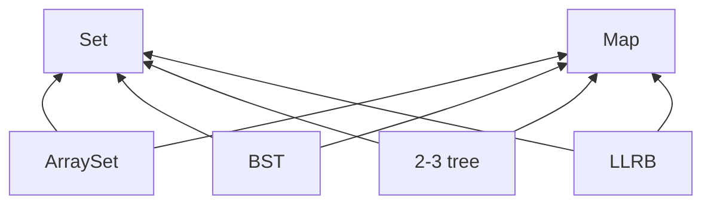
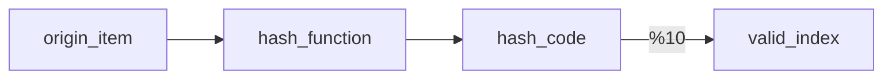

#data_structure 
main function add()/contains()

沿用十进制的理念，选定合适的值作为底数为每一个item创建特殊值，避免了重复值的出现
ASCII 126
chinese character 40959
### integer overflow 
java中最大的整数为2147483647，超过最大值则会溢出从最小值-2147483648开始计算
## hashcode
>[!definition]
>从一个无限甚至较大的集合到拥有固定元素集合的映射

### handling collision
- If bucket h is empty, ==we create a new list containing x and store it at index h.==
- If bucket h is already a list, ==we add x to this list if it is not already present.==
- Bucket \#h is a “separate chain” of all items that have hash code h.

### Separate Chaining Performance

|Worst case time|contains(x)|add(x)|
|-----|------|--------|
|Bushy BST| Θ(log N)| Θ(log N)|
|DataIndexedArray | Θ(1)| Θ(1)|
|Separate Chaining Data Indexed Array|Θ(Q) |Θ(Q)|
### HashTable
- Data is converted by a hash function into an integer representation called a hash code
- The hash code is then reduced to a valid index, usually using the modulus operator

worst case Θ(N) <= Q <= best case Θ(N/5)
>[!improvement]
> buckets M = Θ(N),then O(N/M)=O(1)
>  resizing logic,when N/M is ovet the limit we set,then resize M

***维持hashtable的良好性能，需尽量维持item的平均分配***
***java中所有对象必须实现`.hashCode()`方法***
***`Math.floorMod()` for unsigned integer***

Load factor = number of items / number of buckets
Bucket number = hash code % number of buckets
>[!attention]
never store objects than can change in a HasSet or HashMap
部分object的`hashCode`方法都调用了`equal`
==A typical hash code base is a small prime.==

`Strings hash code in java 8`
```java 
@Override
public int hashCode() {        //String hashCode
    int h = cachedHashValue;
    if (h == 0 && this.length() > 0) {
        for (int i = 0; i < this.length(); i++) {
            h = 31 * h + this.charAt(i);
        }
        cachedHashValue = h;          //提高计算速度
    }
    return h;
}
```

```java
@Override
public int hashCode() {                     //binary tree hashCode 
   if (this.value == null) {
       return 0;
   }
   return  this.value.hashCode() +
    31 * this.left.hashCode() +
    31 * 31 * this.right.hashCode();
}
```

>[!Summary]
>Hash tables
>- Data is converted into a hash code.
>- The hash code is then reduced to a valid index.
>- Data is then stored in a bucket corresponding to that index.
>- Resize when load factor N/M exceeds some constant.
>- If items are spread out nicely, you get Θ(1) average runtime.