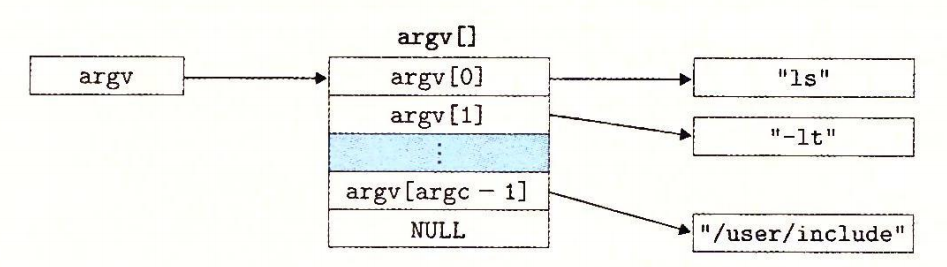
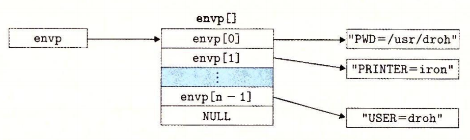
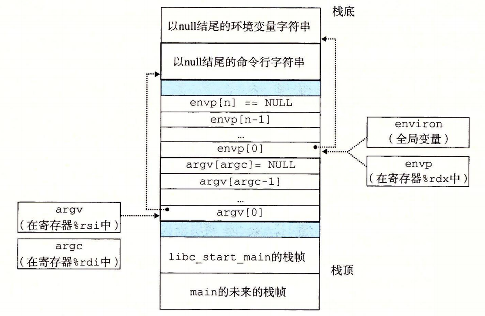
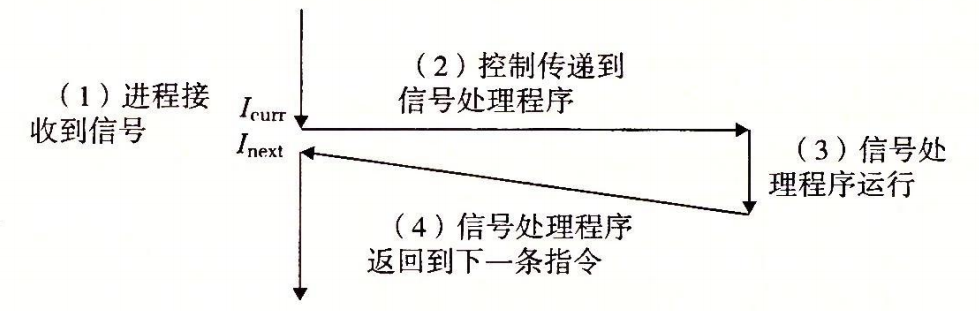
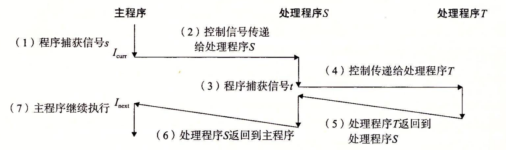

# basics

> [!definition]
> An exception is an abrupt change in the control flow in response to some
> change in the processor’s state!

# exceptions

![[Pasted image 20240801181726.png]]
In any case, when the processor detects that the event has occurred, ==it makes
an indirect procedure call (the exception)==, through a jump table called an _exception table_, to an operating system subroutine (**the exception handler**) that is specifically designed to process this particular kind of event

^**consequence**

1. returns to the current instruction
2. returns to the next instructions if not event occured
3. the handler abort the interrupted program

## handling

![[Pasted image 20240801182735.png]]
^exception table
assigned by ==designers of the processor and the operating system== kernel
The exception number is an index into the exception table, whose starting address is contained in a special CPU register called the exception table base register.

## classes of exceptions

![[Pasted image 20240801183431.png]]

### traps and system calls

use mode: regular function call (limited instructions)
kernel mode: allows it to execute instructions ,and access a stack in kernel

### fault and abort

fault may or may not return control
abort never return the control
![[Pasted image 20240801184001.png]]

# process

> [!definition]
> The classic definition of a process is an instance of a program in execution.
> Each program in the system runs in the context of some process.The context
> consists of the state that the program needs to run correctly. This state includes the program’s code and data stored in memory, its stack, the contents of its generalpurpose registers, its program counter, environment variables, and the set of open file descriptors.

## logical control flow

This sequence of PC values is known as a logical control flow, or simply logical
flow.
![[Pasted image 20240801184428.png]]

> [!note] concurrency
> The general phenomenon of multiple flows executing concurrently is known as concurrency. The notion of a process taking turns with other processes is also
> known as multitasking. Each time period that a process executes a portion of its
> flow is called a time slice. Thus, multitasking is also referred to as time slicing.

![[Pasted image 20240801184826.png]]The /proc filesystem exports the contents of many kernel data structures as a hierarchy of text files that can be read by user programs.

![[Pasted image 20240801185612.png]]

# system call error handling

通过使用错误处理包装函数，对于一个给定的基本函数 foo，我们定义一个具有相同参数的包装函数 Foo，但是第一个字母大写了。包装函数调用基本函数，检査错误，如果有任何问题就终止。

```c
pid_t Fork(void)
{
    pid_t pid;
    if ((pid = fork()) < 0)
        unix_error("Fork error");
    return pid;
}
```

# process control

## obtain process IDs

getpid 函数返回调用进程的 PID。getppid 函数返回它的父进程的 PID（创建调用进程的进程）。

## creating and terminating processes

1. running
2. stopped
3. terminated
   1. receive signal to terminate
   2. return from the main routine
   3. calling the exit function

新创建的子进程几乎但不完全与父进程相同。子进程得到与父进程用户级虚拟地址空间相同的（但是独立的）一份副本，包括代码和数据段、堆、共享库以及用户栈。子进程还获得与父进程任何打开文件描述符相同的副本，这就意味着当父进程调用 fork 时，子进程可以读写父进程中打开的任何文件。父进程和新创建的子进程之间最大的区别在于它们有不同的 PID。

### function fork

因为它只被调用一次，却会返回两次：一次是在调用进程（父进程）中，一次是在新创建的子进程中。在父进程中，fork 返回子进程的 PID。在子进程中，fork 返回 0。

```c
int main()
{
    pid_t pid;
    int x = 1;

    pid = Fork();
    if (pid == 0) { /* Child */
        printf("child : x=%d\n", ++x);
        exit(0);
    }

    /* Parent */
    printf("parent: x=%d\n", --x);
    exit(0);
}
```

## recycle subprocess

当一个进程由于某种原因终止时，内核并不是立即把它从系统中清除。相反，进程被保持在一种已终止的状态中，直到被它的父进程**回收**（reaped）。当父进程回收已终止的子进程时，内核将子进程的退出状态传递给父进程，然后抛弃已终止的进程，从此时开始，该进程就不存在了。一个终止了但还未被回收的进程称为**僵死进程**
如果一个父进程终止了，内核会安排 init 进程成为它的孤儿进程的养父。init 进程的 PID 为 1，是在系统启动时由内核创建的，它不会终止，是所有进程的祖先。==如果父进程没有回收它的僵死子进程就终止了，那么内核会安排 init 进程去回收它们==。不过，长时间运行的程序，比如 shell 或者服务器，总是应该回收它们的僵死子进程。即使僵死子进程没有运行，它们仍然消耗系统的内存资源。

### function waitpid

1. if Pid>0,那么等待集合就是一个单独的子进程，它的进程 ID 等于 pid
2. 如果 Pid=-1，那么等待集合就是由父进程所有的子进程组成的。

### function wait

```cpp
#include <sys/types.h>
#include <sys/wait.h>
pid_t wait(int *statusp);
// 返回：如果成功，则为子进程的 PID，如果出错，则为 -1。
```

## sleep

```c
unsigned int snooze(unsigned int secs) {
    unsigned int rc = sleep(secs);
    printf("Slept for %d of %d secs.\n", secs - rc, secs);
    return rc;
}
```

## load and excute program

### function execve

```c
#include <unistd.h>
int execve(const char *filename, const char *argv[],
           const char *envp[]);
// 如果成功，则不返回，如果错误，则返回 -1。
```




当 main 开始执行时，用户栈的组织结构如图 8-22 所示。让我们从栈底（高地址）往栈顶（低地址）依次看一看。首先是参数和环境字符串。栈往上紧随其后的是以 null 结尾的指针数组，其中每个指针都指向栈中的一个环境变量字符串。全局变量 environ 指向这些指针中的第一个 envp[0]o 紧随环境变量数组之后的是以 null 结尾的 argv[] 数组，其中每个兀素都指向栈中的一个参数字符串。在栈的顶部是系统启动函数 libc_start_main 的栈帧。


## fork&execve

```c
#include "csapp.h"
#define MAXARGS 128
/* Function prototypes */
void eval(char *cmdline);
int parseline(char *buf, char **argv);
int builtin_command(char **argv);
int main()
{
    char cmdline[MAXLINE]; /* Command line */
    while (1) {
        /* Read */
        printf("> ");
        Fgets(cmdline, MAXLINE, stdin);
        if (feof(stdin))
            exit(0);
        /* Evaluate */
        eval(cmdline);
    }
}
```
# signals
# signals

## terminals


一个发出而没有被接收的信号叫做待处理信号（pending signal）。在任何时刻，一种类型至多只会有一个待处理信号。如果一个进程有一个类型为上的待处理信号，那么任何接下来发送到这个进程的类型为左的信号都不会排队等待；它们只是被简单地丢弃。一个进程可以有选择性地阻塞接收某种信号。当一种信号被阻塞时，它仍可以被发送，但是产生的待处理信号不会被接收，直到进程取消对这种信号的阻塞。

## sending signals

### process group

getpgrp()返回当前进程的进程组 id
setpgid 函数将进程 pid 的进程组改为 pgid。如果 pid 是 0，那么就使用当前进程的 PID。如果 pgid 是 0，那么就用 pid 指定的进程的 PID 作为进程组 ID。

### /bin/kill

发送信号 9（SIGKILL）给进程 15213。一个为负的 PID 会导致信号被发送到进程组 PID 中的每个进程。

### kill 函数

如果 pid 大于零，那么 kill 函数发送信号号码 sig 给进程 pid。如果 pid 等于零，那么 kill 发送信号 sig 给调用进程所在进程组中的每个进程，包括调用进程自己。如果 pid 小于零，kill 发送信号 sig 给进程组 |pid|（pid 的绝对值）中的每个进程。

```c
#include <sys/types.h>
#include <signal.h>
int kill(pid_t pid, int sig);
// 返回：若成功则为 0，若错误则为 -1。
```

## receiving signal

> [!definition]
> 当内核把进程 p 从内核模式切换到用户模式时（例如，从系统调用返回或是完成了一次上下文切换），它会检查进程 p 的未被阻塞的待处理信号的集合（pending &~blocked）。如果这个集合为空（通常情况下），那么内核将控制传递到 p 的逻辑控制流中的下一条指令（Inext）。然而，如果集合是非空的，那么内核选择集合中的某个信号 k （通常是最小的 k），并且强制 p 接收信号 k。收到这个信号会触发进程采取某种行为。一旦进程完成了这个行为，那么控制就传递回 p 的逻辑控制流中的下一条指令（Inext）。



1. SIG_BLOCK：把 set 中的信号添加到 blocked blocked=blocked | set）。
2. SIG_UNBLOCK：从 blocked 中删除 set 中的信号（blocked=blocked &~set）。
3. SIG_SETMASK：block=set。
# nonlocal jump
