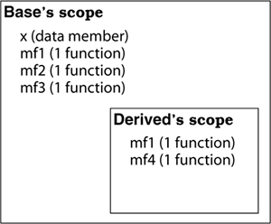
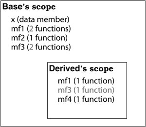
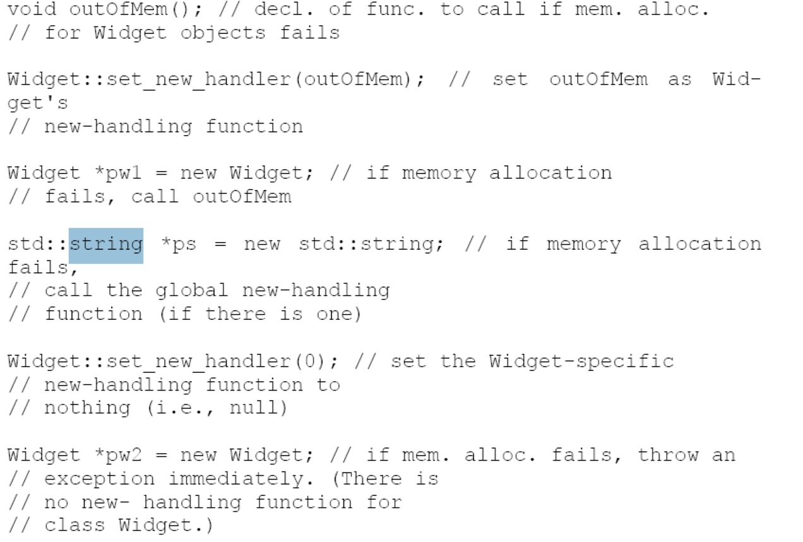
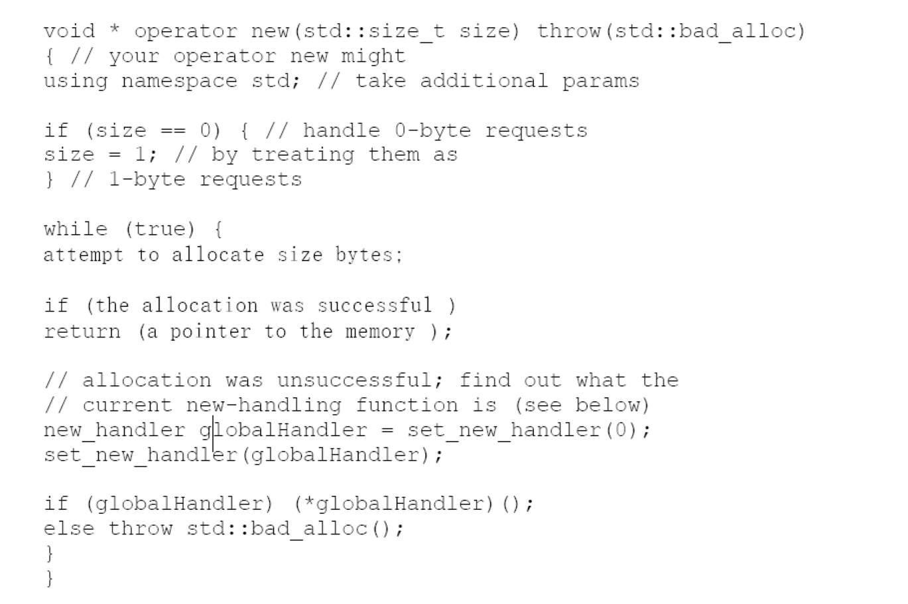

## overview of the c++ language
1. language C
2. object-oriented C++
3. template C++
4. STL (template library)
four parts have different feature to handle problems
## prefer const to \# define
using macro make it hard to debug ,
### enum hack
```cpp
class GamePlayer{
    private:
    enum {NumTurns =5};
    int scores[NumTurns];
    ...
}
```
但是较老的C++编译器，可能不支持类内初始化，这样我们的静态常量，必须要在类外初始化。enum hack works here
### inline function
1. need definition before first call
2. inline function must not include loop or switch 
3. defition always in header file
## use const whenever possible
- const *pointer (const data)
- \* const pointer (const pointer)
- const * const pointer(const data ,const pointer)
>using const to determine which member function have right to alter member
### const function
 return type of the non-const operator[] is a reference,it's never legal to modify the return value of a function that returns a built-in type
### avoid const and non-const code duplication
const_cast(cast between const and non-const)
static_cast(add const)
```cpp
const char& operator[](std::size_t position) const{
}
char& operator[] (std::size_t position){
    return const_cast <char&> static_cast <const TextBlock&>(*this)[position];
}
```
## make sure objects are initialized before they're used
make sure that all constructors initialize everything in the object.
### using member initialization list 
ABEntry:: ABEntry(const std::string& name, const std::string& address,const std::list<PhoneNumber>& phones): theName(name),theAddress(address),thePhones(phones),numTimesConsulted(0)
{} // the ctor body is now empty
>the typical assignment constrcutor is not effective as initialization list
>data members are initialized in the order in which they are declared
### non-local static objects
## default function silently writes
- constructor
- copy assign constructor
- copy constructor
- desctructor
there are special case where default function won't be created 
>remberence: Compilers may implicitly generate a class's default constructor, copy constructor, copy assignment operator, and destructor
## disable the defaulted functions
>declaring member functions and delib‐ private erately not implementing them — is so well established, it's used to prevent copying in several classes in C++'s iostreams library
```cpp
private:
...
HomeForSale(const HomeForSale&);
HomeForSale&operator=(const HomeForSale&); //parameter names can be omited
```
using such class as base case to inherit the uncopopy feature
## declare vitural destructor in polymorphic class
>declare a virtual destructor in a class if and only if that class contains at least one virtual function,or the class just works as base case
## preventing exception in destructor 
```cpp
class DBConn{
public:
void close(){ // client use
db.close();
closed = true;
}
~DBConn(){
    if(!closed){
        try { // close the connection
            db.close(); // if the client didn't
        }
        catch (...){ // if closing fails,make log entry that call to close failed; // note that and  terminate or swallow
        }
    }
}
private:
DBConnection db;
bool closed;
};
```
## Never call virtual functions during construction or destruction
## Have assignment operators return a reference to *this
```cpp
class Widget{
public:
...
Widget& operator=(const Widget& rhs){
return *this; //return the left-hand object
}
}
```
## Handle assignment to self in operator=
```cpp
Widget& Widget::operator=(const Widget& rhs) //unsafe impl. ofoperator=
{
    delete pb; // stop using current bitmap
    pb = new Bitmap(* rhs.pb); // start using a copy of rhs's bit-map
    return *this; // see Item 10
}

---
Widget& Widget::operator=(const Widget& rhs)
{Bitmap *pOrig = pb; // remember original pb
pb = new Bitmap(*rhs.pb); // point pb to a copy of rhs's bitmap
delete pOrig; // delete the original pb
return *this;
}
```
Make sure is well-behaved when an object is assigned to it‐ operator= self. Techniques include comparing addresses of source and target objects, careful statement ordering, and copy-and- . swap . Make sure that any function operating on more than one object be‐ haves correctly if two or more of the objects are the same.
## copy all parts of your object
update your copy constructor when you update your class member 
# resource 
## using object to manage resources
by putting resources inside objects, we can rely on C++'s automatic destructor invocation to make sure that the resources are released
>abstrction
resource acquistion is initialization 
```cpp
auto_ptr<Investment> pInv(createInvestment());
//
```
1. Resources are acquired and immediately turned over to resourcemanaging objects
2. resource-managing objects use their destructors to ensure that resources are released.
>example share_ptr unique_ptr
## be careful with copying behavior in resource-managin classes
1. prohibit copying When copying makes no sense for an RAII class, you should prohibit it.
2. Reference-count the underlying resource
```cpp
class Lock{
    public:
    explicit Lock(Mutex *pm):mutexPtr(pm,unlock){
        lock(mutexPtr.get());
    }
    private:
    std::tr1::shared_ptr<Mutex> mutexPtr;
}
```
the second parameter to the share_ptr constructor
3. copy the underlying resources
4. Transfer ownership of the underlying resource.
## provide access to raw resources in resource managing classes
convert an object of the RAII class into the raw resource it contains
1. get() member function to return the raw pointer
2. overload -> and * operator
## correspondent form fo delete and new keywords
If you use [] in a new expression, you must use [] in the corresponding delete expression. If you don't use [] in a new expression, you mustn't use [] in the corresponding delete expression.
## store newed objects in smart pointers in standlone statements.
# implementations
## Postpone variable definitions as long as possible
```cpp
std::string encryptPassword(const std::string& password){
    string encrypted(password);// postpone the definition until you have initialization arguments for it.
    encrypt(encrypted);
    return encrypted;
}
```
### loop related
assignment cost less than a constructor-desctructor pair(mostly definition outside)
## minimize casting
### c style cast
```c
(T) expression
T(expression)
```
### c++ cast
```cpp
const_cast<T>( expression) //cast away cnstness
dynamic_cast<T>( expression)//safe downcasting in inheriatnce hierarchy
reinterpret_cast<T>( expression)//less used
static_cast<T>( expression)//force implicit conversions (non-const to const)
```
```cpp
class SpecialWindow:public Window{
public:
virtual void onResize(){
Window::onResize();
// call Window:: onResize
... // on *this
}
};
```
### dynamic_cast
1. When casting is necessary, try to hide it inside a function. Clients can then call the function instead of putting casts in their own code.
2. Prefer C++-style casts to old-style casts. They are easier to see, and they are more specific about what they do.
## avoid returning "handle" to object internals
Avoid returning handles (references, pointers, or iterators) to object internals. It increases encapsulation, helps member functions const act , and minimizes the creation of dangling handles
## strive for exception-safe code
### exception-safe functions offer  one of three guarantees
1. Functions offering the basic guarantee promise that if an exception is thrown, everything in the program remains in a valid state
2. Functions offering the strong guarantee promise that if an exception is thrown, the state of the program is unchanged
3. Functions offering the nothrow guarantee promise never to throw ex‐ ceptions, because they always do what they promise to do
```cpp
class PrettyMenu{
...
std::tr1::shared_ptr<Image> bgImage;
...
};
void PrettyMenu::changeBackground(std::istream& imgSrc){
    Lock ml(&mutex);
    bgImage.reset(new Image(imgSrc)); // replace bgImage'sinternal pointer with the result of the "new Image" expression
    ++imageChanges;
}
```
1. resource management objects
2. at least one exception ganrantee for your function
## undestand the ins and outs of inlining
Inline functions must typically be in header files, because most build envi‐ ronments do inlining during compilation.
1. Limit most inlining to small, frequently called functions. This facili‐ tates debugging and binary upgradability, minimizes potential code bloat, and maximizes the chances of greater program speed.
2. Don't declare function templates inline just because they appear in header files.
## minimize compilation dependencies between files
1. make your header files self-sufficient whenever it's practical, and when it's not, depend on declarations in other files, not definitions. Everything else flows from this simple design strategy
2. Use Handle classes and Interface classes during development to minimize the impact on clients when implementations change.
# Inheritance and Object- Oriented Design
## make sure public inheritance models 'is-a'
>[keypoint]
is-a not vice versa
1. You are saying that B represents a more general concept than D , that D represents a more specialized concept than B .
## avoid hiding inherited names

```cpp
class Base{
    private:
    int x;
    public:
    virtual void mf1()=0;
    virtual void mf1(int);
    virtual void mf2();
    void mf3();
    void mf3(double);
    ...
}
class Derived:public Base{
    public:
    //using Base::mf1;
    //using Base::mf3;
    virtual void mf1();
    void mf3();
    void mf4();
    ...
}
```

- Names in derived classes hide names in base classes. Under public inheritance, this is never desirable.

- To make hidden names visible again, employ using declarations or forwarding functions
## Differentiate between inheritance of interface and inheritance of implementation
The differences in declarations for pure virtual, simple virtual, and non-vir‐ tual functions allow you to specify with precision what you want derived classes to inherit: interface only, interface and a default implementation, or interface and a mandatory implementation, respectively
• Inheritance of interface is different from inheritance of implementa‐ tion. Under public inheritance, derived classes always inherit base class interfaces.
• Pure virtual functions specify inheritance of interface only.
• Simple (impure) virtual functions specify inheritance of interface plus inheritance of a default implementation.
• Non-virtual functions specify inheritance of interface plus inheri‐ tance of a mandatory implementation.
## consider alternatives to virtual functions
### non-virtual interface 
public non-virtual member function wraps the private virtual function(NVI)
### the strategy Pattern via function Pointers
```cpp
class GameCharacter;
class GameCharacter{
    public:
    typedef int (*HealthCalcFunc)(const GameCharacter&);
    int defaultHealthCalc(const GameCharacter& gc);
    explicit GameCharacter(HealthCalcFunc hcf=defaultHealthCalc):healthFunc(hcf){}
    int healthValue() const{return healthFunc(*this);}
    private:
    HealthCalcFunc healthFunc;
};
```
### tr::function
// todo need further implementations
### Replace virtual functions in one hierarchy with virtual functions in an‐ other hierarchy
non-virtual functions like B::mf and D::mf are statically bound
virtual functions are dynamically bound
example(virtual desctructor)
## no redefine the default parameter in inherited function
Never redefine an inherited default parameter value, because default parameter values are statically bound,
## use private inheritance judiously
not is-a but is-implement-a 
## multiple inheritances
### virtual inheritance 
need implementation
# templates and genetic programming 
## typename and class in template 
1. when declaring template parameters, class and typename are interchangeable. 
2. use typename to identify nested dependent type names, except in base class lists or as a base class identifier in a member initialization list
## know how to access name in templatized base class
template<> syntax means the specialized version of the MsgSender template to be used
>it recognizes that base class templates may be special‐ ized and that such specializations may not offer the same interface as the general template. As a result, it generally refuses to look in templatized base classes for inherited names
### methods to look in templatized base classes
```cpp
void sendClearMsg(const MsgInfo& info){
    //write "before sending" info to the log;
this-> sendClear(info); // okay, assumes that sendClear
}
```
---
```cpp
class LoggingMsgSender:public MsgSender<Company>{
public: 
using MsgSender<Company>::sendClear;
void sendClearMsg(const MsgInfo& info)
{.
..sendClear(info);// tell compiler to assume tha member exists in the base case
}
}
```
```cpp
---
void sendClearMsg(const MsgInfo& info)
{
MsgSender<Company>::sendClear(info); // okay, assumes that sendClear will be
}
```
## template factor
sense the repli‐ cation that may take place when a template is instantiated multiple times.
### implicit reproduce
```cpp
SquareMatrix<double,5> sm1;
sm1.invert();// call SquareMatrix <double,5>::invert;
SquareMatrix<double,10> sm2;
sm2.invert(); // call SquareMatrix<double, 10>::invert
```
• emplates generate multiple classes and multiple functions, so any template code not dependent on a template parameter causes bloat.
• Bloat due to non-type template parameters can often be eliminated by replacing template parameters with function parameters or class data members.
• Bloat due to type parameters can be reduced by sharing implementa‐ tions for instantiation types with identical binary representations.
## member function tem‐ plates
```cpp
template<typename T> 
class SmartPtr{
public:
template<typename U> // member template
SmartPtr(const SmartPtr<U>& other); // for a "generalized
... // copy constructor"
};
```

# customizing new and delete
the heap memory fo STL containers is managed by the containers' allocator objects
## the behavior of the new-handler
当new未能分配足够的内存空间，会调用错误处理的函数new-handler
```cpp
namespace std {
typedef void (*new_handler)(); //pointer to a function with no arguments and no returns
new_handler set_new_handler (new_handler p) throw();// throw any exceptions
}
```

### case1
如果未能分配足够的内存将会重复调用new-handler function 
```cpp
void outOfMem()
{
    std::cerr<<"Unable to satisfy request for memory\n";
    std::abort();
}
    int main(){
        std::set_new_handler(outOfMem);
        int *pBigDataArray=new int{100000000L};
        ...
    }
```
1. make more memory available
2. install a different new-handler(have the handler modify static)
3. pass the null pointer to set_new_handler
4. type bad_alloc derived from bad_alloc
5. calling abort or exit
---

do not use nothrow new
## when it makes sense to replace new and delete
### purposes
1. to detect usage errors
2. to improve efficiency(customized version)
3. to collect suage statstics
Many computer architectures require that data of particular types be placed in memory at particular kinds of addresses
## adhere to convention when writing new and delete
when the pointer to the new-handling function is null does operator new throw an exception.


