# using mysql

default port:3306

## steps to use tables and databases

1. show databases;
2. use (database name);
3. show tables;
4. show columns from emp; # select column from table

### show command

1. show status
2. show create database/show create table
3. show grants
4. show error/ show warnings

# select data

## single columns

select id from emp;

## multi columns

select id,age,fullname from emp;

## select all columns

select \* from emp;

## select distinct rows

select ==distinct== gender from emp;

## limit the search result

select fullname from emp limit 3;
所以，带一个值的 LIMIT 总是从第一行开始，给出的数为返回的行数。带两个值的 LIMIT 可以指定从行号为第一个值的位置开始。

## use full delimeter names

select emp.fullname from emp;

# sort data

clause: keyword plus data

> [!example]
> from emp;
> order by fullname;
> default in ascend order
> keyword "desc"/"asc" to be in descend/ascend order

# filter data

select fullname,id from emp ==where gender=male==;
在同时使用 ORDER BY 和 WHERE 子句时，应该让 ORDER BY 位于 WHERE 之后，否则将会产生错误.

## operations in clause

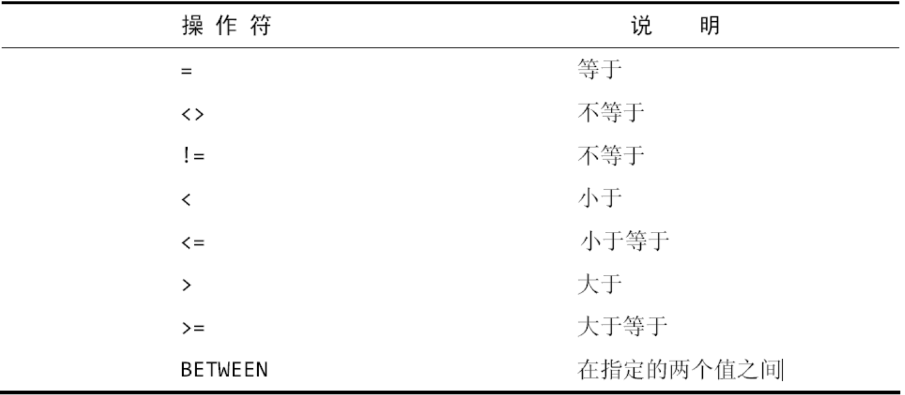

### single value

MySQL 在执行匹配时默认不区分大小写
between A and B
is null # to check null

# data filer

## group where clause

1. and
2. or
   and 计算优先于 or,需要使用括号实现特定计算条件

## in operator

equal to or
in (a,b)

## not

deny where clause

# placeholder to filter

## like

instruct to match rather than compare

## wildcard

\% 任何字符出现任意次数(including zero)
\_ 只匹配单个字符

# regular expression

clause: regexp '1000'

## or match

clause: regexp '1000|2000'

## multi character match

clause: regexp '[123] ton'

## special charaters

为了匹配特殊字符，必须用\\\为前导。\\\\-表示查找-，\\\\.表示查找.
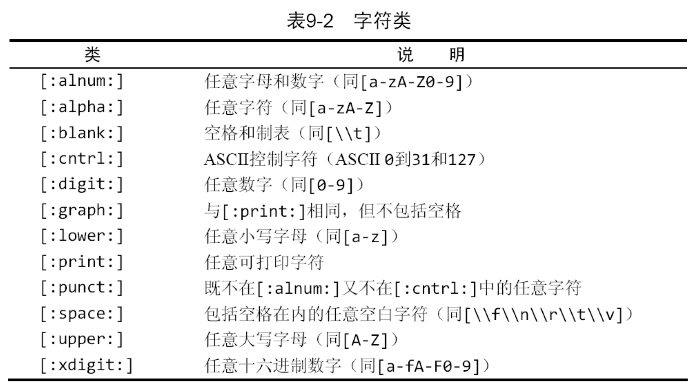

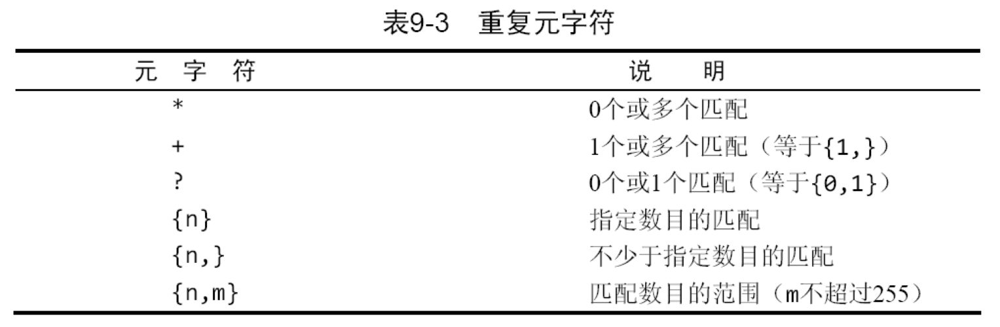

## 定位符

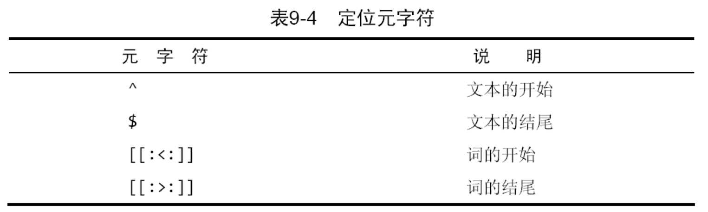

regexp '\^[0-9\\\\.]'

# create calculation words

## concatenate

```sql
select Concat(vend_name,'(', vend_country, ')')
```

多数 DBMS 使用+或||来实现拼接
RTrim()函数去掉值右边的所有空格.同理存在 LTrim()函数

## alias

```sql
select Concat(RTrim(vend_name),' (',RTrim(vend_country), ')') as vend_title from vendors
order by vend_name;
```

# functions

## text manipulate

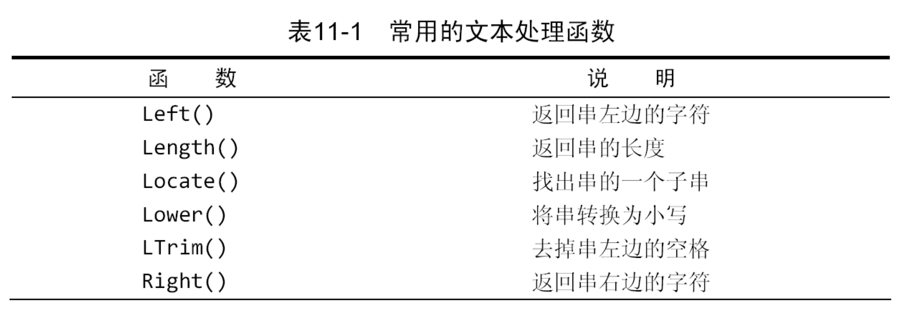
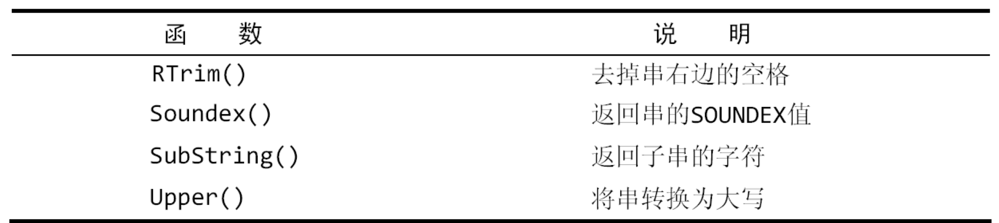

## date and time

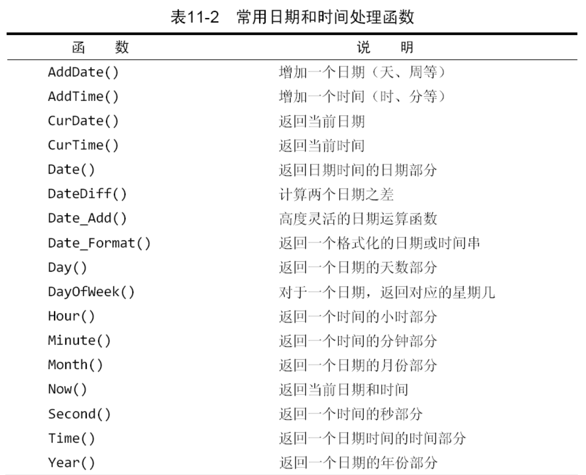
不管是插入或更新表值还是用 WHERE 子句进行过滤，日期必须为格式 yyyy-mm-dd

```sql
select cust_id,order_num
from orders
where Date(order_date) between '2005-09-01' and '2005-09-30';
```

## numbers

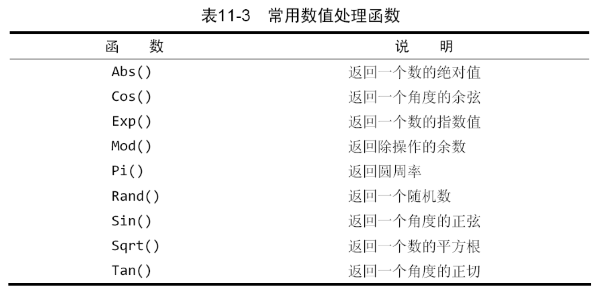

# summary data

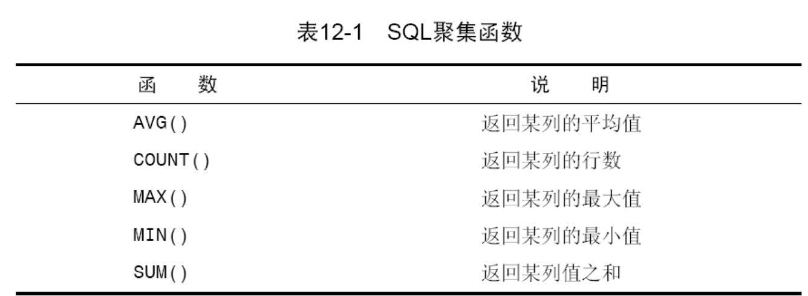

## AVG()

```sql
select AVG(prod_price) as avg_price from products;
```

## count()

1. 使用 COUNT(\*)对表中行的数目进行计数，不管表列中包含的是空值（NULL）还是非空值。
2. 使用 COUNT(column)对特定列中具有值的行进行计数，忽略 NULL 值。

# group data

GROUP BY 子句必须出现在 WHERE 子句之后，ORDER BY 子句之前。

```sql
select vend_id, count(*) as num_prods
from products
group by vend_id;
```

## group filter

```sql
select vend_id, count(*) as num_prods
from products
where prod_price >= 10
group by vend_id
having count(*) >=2;
```

## group ranking

```sql
select order_num,sum(quantity*item_price) as ordertotal
from orderitems
group by order_num
having sum(quantity*item_price)>=50
order by ordertotal;
```

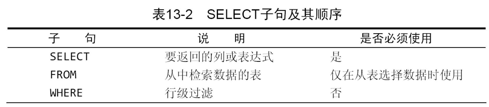
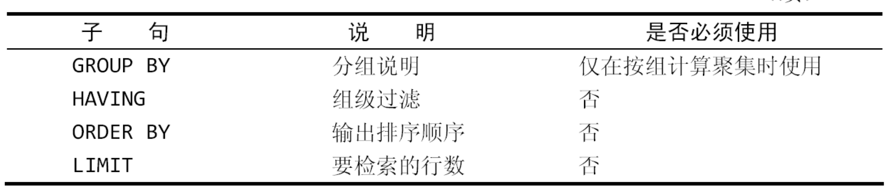

# clause find

```sql
select cust_name,cust_contact
from customers
where cust_id in (select cust_id
                  from orders
				  where order_num in (select order_num
				  					  from orderitems
									  where prod_id = 'TNT2))
```

## calculate words

```sql
select cust_name,
       cust_state,
	   (select count(*)
	   from orders
	   where orders.cust_id = customers.cust_id) as orders
from customers
order by cust_name;
```

# join list

## relation table

> [!definition]

1. 外键为某个表中的一列，它包含另一个表的主键值，定义了两个表之间的关系。
2. 可伸缩性（scale） 能够适应不断增加的工作量而不失败。设计良好的数据库或应用程序称之为可伸缩性好（scale well）。
3. 由没有联结条件的表关系返回的结果为笛卡儿积。

```sql
select vend_name,prod_name,prod_price
from vendors inner join products
on vendors.vend_id=products.vend_id
```

两个表之间的关系 FROM 子句的组成部分,以 INNER JOIn 指定。在使用这种语法时，联结条件用特定子句而不 WHERE 子句给出。传递给 ON 的实际条件与传递给给 WHERE 的相同。

# advanced linking

## table alias

```sql
select cust_name,cust_contact from customers as c, orders as o,orderitems as oi where c.cust_Id=o.cust_id
and oi.order_num=o.order_num
and prod_id = 'TNT2'
```

## self join

```sql
select p1.prod_id,p1.prod_name
from products as p1,products as p2
where p1.vend_id = p2.vend_id
 and p2.prod_id="DTNTR"
```

## outer join

```sql
select customers.cust_id,orders.order_num
from customers left outer join orders
on customers.cust_id = orders.cust_id;
```

# compound query

## keyword union

union rules

1. UNION 必须由两条或两条以上的 SELECT 语句组成，语句之间用关键字 UNION 分隔(因此,如果组合 4 条 SELECT 语句，将要使用 3 个 UNION 关键字)
2. UNION 中的每个查询必须包含相同的列、表达式或聚集函数（不过各个列不需要以相同的次序列出）。
3. 列数据类型必须兼容：类型不必完全相同，但必须是 DBMS 可以隐含地转换的类型
   > [!summary]
4. union all 取消默认重复行
5. SELECT 语句的输出用 ORDER BY 子句排序。在用 UNION 组合查询时，只能使用一条 ORDER BY 子句，它必须出现在最后一条 SELECT 语句之后。

# text search

使用两个函数 Match()和 Against()执行全文本搜索，其中 Match()指定被搜索的列，Against()指定要使用的搜索表达式。

```sql
select note_text,
match(note_text) against ('rabbit')
as rank productonotes;
```

## search extension

```sql
select note_text from productnotes
where match(note_text) against('avnils' with query expansion);
```

## boolean search

```sql
select note_text from productnotes
where match(note_text) against('heavy -rope*' in boolean mode);
```

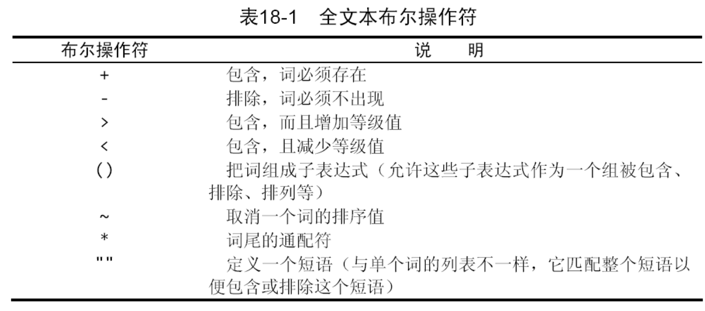

# insert data

## insert complete row

```sql
insert into Customers
values(self_difineds)
```

不管使用哪种 INSERT 语法，都必须给出
VALUES 的正确数目。如果不提供列名，则必须给每个表列提供一个值。如果提供列名，则必须对每个列出的列给出一个值。如果不这样，将产生一条错误消息，相应的行插入不成功

## insert multi rows

其中单条 INSERT 语句有多组值，每组值用一对圆括号括起来，用逗号分隔。

## insert searched data

INSERT SELECT 中 SELECT 语句可包含 WHERE 子句以过滤插入的数据。

# update and delete data

## updata

```sql
update customers
set cust_email='elmer@fudd.com'
where cust_id=10005;
```

> [!summary]

1. 在更新多个列时，只需要使用单个 SET 命令，每个“列=值”对之间用逗号分隔（最后一列之后不用逗号）
2. 为了删除某个列的值，可设置它为 NULL（假如表定义允许 NULL 值）。

## delete data

```sql
delete from customer where
cust_id =10006;
```

# create tables

1. 新表的名字，在关键字 CREATE TABLE 之后给出；
2. 表列的名字和定义，用逗号分隔。
3. 表的主键可以在创建表时用 PRIMARY KEY 关键字指定。
4. 允许 NULL 值的列也允许在插入行时不给出该列的值。不允许 NULL 值的列不接受该列没有值的行，换句话说，在插入或更新行时，该列必须有值。
5. AUTO_INCREMENT 告诉 MySQL，本列每当增加一行时自动增量。每次执行一个 INSERT 操作时，MySQL 自动对该列增量每个表只允许一个 AUTO_INCREMENT 列，而且它必须被索引
6. default initials
7. innodb/memory/myisam

## alter table

```sql
alter table vendors
add vend_phone char(20);# append a new column
```
## remove table 
```sql
drop table vendors
```
## rename table 
rename table vendors
# prospective
作为视图，它不包含表中应该有的任何列或数据，它包含的是一个SQL查询
## create view
1. 视图用CREATE VIEW语句来创建
2. 使用SHOW CREATE VIEW viewname；来查看创建视图的语句
3. 用DROP删除视图，其语法为DROP VIEW viewname
4. 更新视图时，可以先用DROP再用CREATE，也可以直接用CREATE OR REPLACE VIEW。
# saving data

