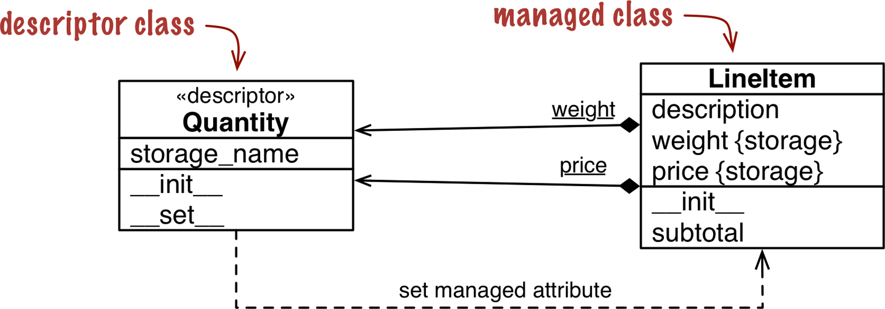

# definition

a descriptor is a class that implements a protocol consisting of the **get**.**set** and **delete** special methods.

1. The **get** method is called when the attribute is accessed.

2. The **set** method is called when the attribute is assigned a value.

3. The **delete** method is called when the attribute is deleted.

# descriptor example



## basic elements

1. descriptor class(implements the decriptor protocol)
2. managed class (where the decriptor are declared as class attribute)
3. ==descritor instance(declared as a class attribute of the managed class)==
4. managed instance(an instance of the managed class)
5. storage attribute(hold the value of a managed attribute for that particular instance)
6. a descriptor instance plus a storage attribute

## example code

```python
class Quantity:
	def __init__(self,storage_name):
		self.storage_name=storage_name
	def __set__(self,instance,value):
		if value>0:
			instance.__dict__[self.storage_name]
		else:
			raise valueError("value must be > 0")
class LineItem:
	weight=Quantity('weight')
	price=Quantity('price')
	def __init__(self,description,weight,price):
		self.description=description
		self.weight=weight
		self.price=price
	def subtotal(self):
		return self.wieght*self.price
```

## example version2

```python
class Quantity:
	__counter = 0
	def __init__(self):
		cls = self.__class__
		prefix = cls.__name__
		index = cls.__counter
		self.storage_name = '_{}#{}'.format(prefix, index)
		cls.__counter += 1
	def __get__(self, instance, owner):
		return getattr(instance, self.storage_name)
	def __set__(self, instance, value):
		if value > 0:
			setattr(instance, self.storage_name, value)
		else:
			raise ValueError('value must be > 0')
class LineItem:
	weight = Quantity()
	price = Quantity()
	def __init__(self, description, weight, price):
		self.description = description
		self.weight = weight
		self.price = price
	def subtotal(self):
		return self.weight * self.price
```

## overrriding versus nonoverriding descriptors

### overriding descriptor

1. A descriptor that implements the \_\_set\_\_ method is called an overriding descriptor.will override attempts to assign to instance attributes.

```python
>>> obj = Managed()
>>> obj.over
-> Overriding.__get__(<Overriding object>, <Managed object>,
<class Managed>)
>>> Managed.over
-> Overriding.__get__(<Overriding object>, None, <class Managed>)
>>> obj.over = 7
-> Overriding.__set__(<Overriding object>, <Managed object>, 7)
>>> obj.over
-> Overriding.__get__(<Overriding object>, <Managed object>,
<class Managed>)
>>> obj.__dict__['over'] = 8
>>> vars(obj)
{'over': 8}
>>> obj.over
-> Overriding.__get__(<Overriding object>, <Managed object>,
<class Managed>)
```
### override Descriptor without \_\_get\_\_
only writing is handled by the descriptor. Reading the descriptor through an instance will return the
descriptor object itself because there is no \_\_get\_\_ to handle that access
```python
>>> obj.over_no_get
<__main__.OverridingNoGet object at 0x665bcc>
>>> Managed.over_no_get
<__main__.OverridingNoGet object at 0x665bcc>
>>> obj.over_no_get = 7
-> OverridingNoGet.__set__(<OverridingNoGet object>, <Managed object>, 7)
>>> obj.over_no_get
<__main__.OverridingNoGet object at 0x665bcc>
>>> obj.__dict__['over_no_get'] = 9
>>> obj.over_no_get
9
>>> obj.over_no_get = 7
-> OverridingNoGet.__set__(<OverridingNoGet object>, <Managed object>, 7)
>>> obj.over_no_get
9
```
### nonoverriding descriptor
Setting an instance attribute with the same name will shadow the descriptor, rendering it ineffective for handling that attribute in that specific instance
```python
>>> obj = Managed()
>>> obj.non_over
-> NonOverriding.__get__(<NonOverriding object>, <Managed object>,
<class Managed>)
>>> obj.non_over = 7
>>> obj.non_over
7
>>> Managed.non_over
-> NonOverriding.__get__(<NonOverriding object>, None, <class Managed>)
>>> del obj.non_over
>>> obj.non_over
-> NonOverriding.__get__(<NonOverriding object>, <Managed object>,
<class Managed>)
```
## overwriting a decriptor in the class
```python
>>> obj = Managed()
>>> Managed.over = 1
>>> Managed.over_no_get = 2
>>> Managed.non_over = 3
>>> obj.over, obj.over_no_get, obj.non_over
(1, 2, 3)
```
the reading of a class attribute can be controlled by a descriptor with \_\_get\_\_ attached to the managed class
the writing of a class attribute cannot be handled by a
descriptor with attached to the same class. \_\_set\_\_
## methods are descriptor
```python
>>> obj = Managed()
>>> obj.spam
<bound method Managed.spam of <descriptorkinds.Managed object at 0x74c80c>>
>>> Managed.spam
<function Managed.spam at 0x734734>
>>> obj.spam = 7
>>> obj.spam
```
the \_\_get\_\_ of a function returns a
reference to itself when the access happens through the managed class. But when the access goes through an instance, the \_\_get\_\_ of the function returns a bound method object: a callable that wraps the function and binds the managed instance (e.g., obj) to the first argument of the function
>[!summary]
>1.  a method called on the class works as a function
>2.  Calling its with an instance \_\_get\_\_ retrieves a method bound to that instance.
>3. Calling the function’s \_\_get\_\_ with None as the instance argument retrieves the function itself
>4. instance.reverse==Class.reverse.\_\_get\_\_(instance)
>5. The bound method object has a attribute holding a reference to the \_\_self\_\_ instance on which the method was called
>6. The attribute of the bound method is a reference to the original \_\_func\_\_ function attached to the managed class
7. call=>func=>self