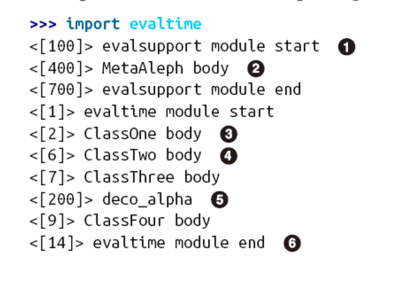
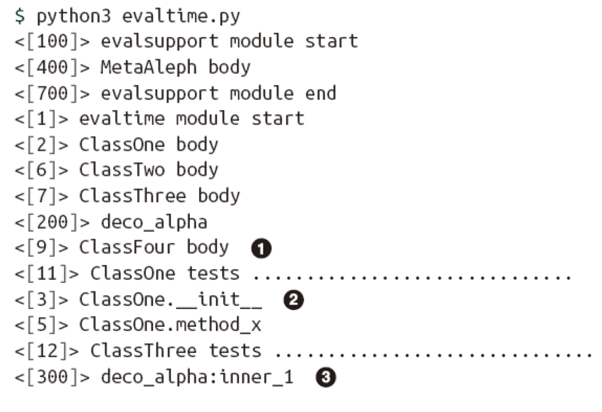
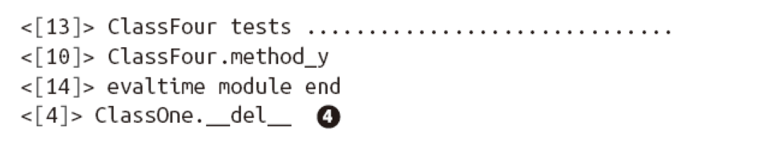
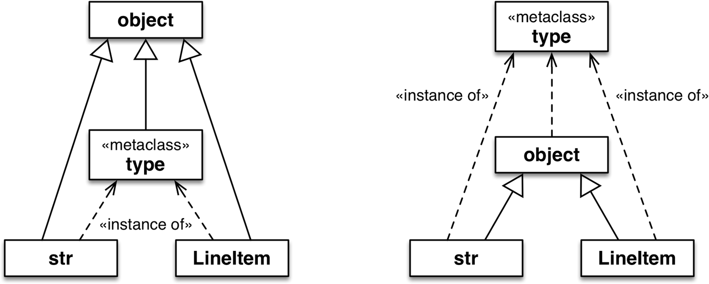
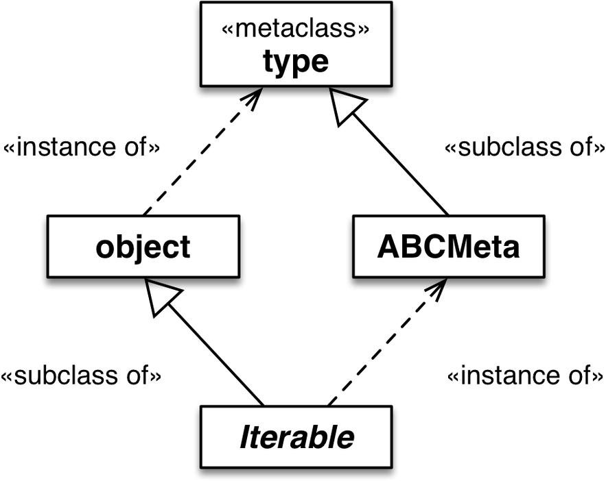
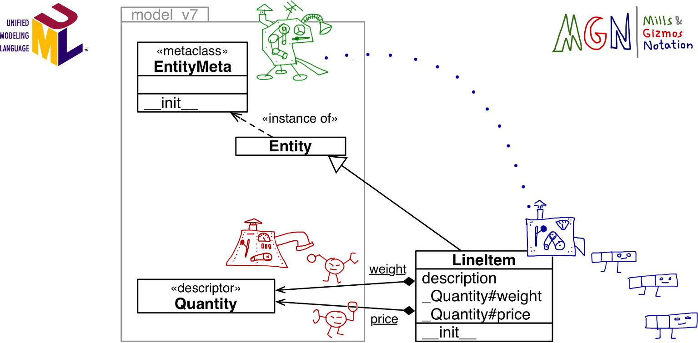

# class factory

```python
def record_factory(cls_name, field_names):
	try:
	field_names = field_names.replace(',', ' ').split()
	except AttributeError: # no .replace or .split
		pass # assume it's already a sequence of identifiers
	field_names = tuple(field_names)
	def __init__(self, *args, **kwargs):
		attrs = dict(zip(self.__slots__, args))
		attrs.update(kwargs)
		for name, value in attrs.items():
			setattr(self, name, value)
	def __iter__(self):
		for name in self.__slots__:
			yield getattr(self, name)
def __repr__(self):
	values = ', '.join('{}={!r}'.format(*i) for i
			in zip(self.__slots__, self))
	return '{}({})'.format(self.__class__.__name__, values)
cls_attrs = dict(__slots__ = field_names,
	__init__ = __init__,
	__iter__ = __iter__,
	__repr__ = __repr__)
return type(cls_name, (object,), cls_attrs)
```

## type class

type(name,bases,dict)

```python
MyClass = type('MyClass', (MySuperClass, MyMixin),
{'x': 42, 'x2': lambda self: self.x * 2})
```

# class decorator for customizing descriptors

it's a function that gets a class object and returns the same class or a modified one.

```python
import model_v6 as model
@model.entity
class LineItem:
	description = model.NonBlank()
	weight = model.Quantity()
	price = model.Quantity()
	def __init__(self, description, weight, price):
		self.description = description
		self.weight = weight
		self.price = price
	def subtotal(self):
		return self.weight * self.price
	### the entity  function
	def entity(cls):
		for key, attr in cls.__dict__.items():
			if isinstance(attr, Validated):
				type_name = type(attr).__name__
				attr.storage_name = '_{}#{}'.format(type_name, key)
		return cls
```

subclasses of the decorated class may or may not inherit
the changes made by the decorator, depending on what those changes are

# import time VS runtime

![[Pasted image 20240626143752.png]]

## scenario 1 import from console



## scenario 2 python run




# metaclass 101

by default ,all class in python are instance of type and subclasses of object.metaclasses
are also subclasses of type, so they act as class factories



---



## metaclass evaluation time

```python
class ClassFive(metaclass=MetaAleph):
	print('<[6]> ClassFive body')
	def __init__(self):
		print('<[7]> ClassFive.__init__')
	def method_z(self):
		print('<[8]> ClassFive.method_y')
class ClassSix(ClassFive):
	print('<[9]> ClassSix body')
	def method_z(self):
		print('<[10]> ClassSix.method_y')

### the metaclass source code
class MetaAleph(type):
	print('<[400]> MetaAleph body')
	def __init__(cls, name, bases, dic):
		print('<[500]> MetaAleph.__init__')
		def inner_2(self):
			print('<[600]> MetaAleph.__init__:inner_2')
		cls.method_z = inner_2
```

using metaclass can inheritance from the metaclass

# a metaclass for customizing desciptor



# the metaclass \_\_prepare\_\_ special methods

```python
class EntityMeta(type):
"""Metaclass for business entities with validated fields"""
	@classmethod
	def __prepare__(cls, name, bases):
		return collections.OrderedDict()
	def __init__(cls, name, bases, attr_dict):
		super().__init__(name, bases, attr_dict)
		cls._field_names = []
		for key, attr in attr_dict.items():
			if isinstance(attr, Validated):
				type_name = type(attr).__name__
				attr.storage_name = '_{}#{}'.format(type_name, key)
				cls._field_names.append(key)
class Entity(metaclass=EntityMeta):
"""Business entity with validated fields"""
	@classmethod
	def field_names(cls):
		for name in cls._field_names:
			yield name
```

# classes as objects

^90f5da

1. cls.\_\_bases\_\_  the tuple fo base classes of the class
2. cls.\_\_qualname\_\_ equals to scope+\_\_name\_\_
3. cls.\_\_subclass\_\_
4. cls.mro() return the order of the specific order of parent classes,equals to cls.__mro__
