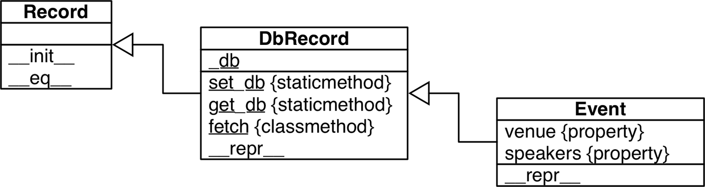
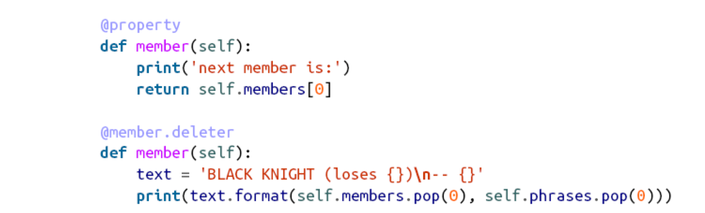

# dynamic attributes
## json-like data with dynamic attributes
```python
>>> from osconfeed import load
>>> raw_feed = load()
>>> feed = FrozenJSON(raw_feed)
>>> len(feed.Schedule.speakers)
357
>>> sorted(feed.Schedule.keys())
['conferences', 'events', 'speakers', 'venues']
>>> for key, value in sorted(feed.Schedule.items()):
... print('{:3} {}'.format(len(value), key))
```
### the FrozenJSON class
1. \_\_init\_\_()
2. \_\_getattr\_\_() first look if the self.\_\_data dict has an attribute (not a key!)
3. \_\_data support any dict method

## the invalid attribute name
```python
grad = FrozenJSON({'name': 'Jim Bo', 'class': 1982})
grad.class //keyword check fail
```
>[!extention]
>the \_\_new\_\_() return  a instance and in turn be passed as the first argument *self* of \_\_init\_\_()
```python
def object_maker(the_class, some_arg):
	new_object = the_class.__new__(some_arg)
	if isinstance(new_object, the_class):
		the_class.__init__(new_object, some_arg)
	return new_object
```
## the sheve package
1. shelve.Shelf subclass abc.MutableMapping
2. shelve.Shelf provides a few other I/O manager methods
3. keys and values are saved whenever a new value is assigned to a key
4. keys must be strings
5. the values must be the object that the pickle module can handle
```python
import shelve
db = shelve.open(DB_NAME) # open a db file
if CONFERENCE not in db:
load_db(db) # load the db
speaker = db['speaker.3471']
type(speaker)
<class 'schedule1.Record'>
speaker.name, speaker.twitter
('Anna Martelli Ravenscroft', 'annaraven')
db.close()
```
## linked record retrieval with properties
```python
>>> DbRecord.set_db(db)
>>> event = DbRecord.fetch('event.33950')
>>> event
<Event 'There *Will* Be Bugs'>
>>> event.venue
<DbRecord serial='venue.1449'>
>>> event.venue.name
'Portland 251'
>>> for spkr in event.speakers:
... print('{0.serial}: {0.name}'.format(spkr))
...
speaker.3471: Anna Martelli Ravenscroft
speaker.5199: Alex Martelli
```

>[!attention]
> properties are class attributes designed to manage instance attributes
# use property for attribute validation
```python
class LineItem:
	def __init__(self,description,weight,price):
		self.description = description
		self.weight = weight
		self.price = price
	def subtotal(self):
		return self.weight*self.price
	@property # decorate the getter method
	def weight(self):
		return self.__weight
	@weight.setter # the setter method
	def weight(self,value):
		if value > 0:
			self.__weight = value
		else:
			raise ValueError('value must be > 0)
```
# inspection into property
the property function ^07c5b7
```python
property(fget=None, fset=None, fdel=None, doc=None)
weight = property(get_weight,set_weight)
```
class property can influence how the attribute of such class can be found
## property override instance attributes
```python 
class Class:
	data="the class data attr"
	@property
	def prop(self):
		return 'the prop value'
>>> obj = Class()
>>> vars(obj) # return the __dict__ (the instance attributes)
{}
>>> obj.data # retrive the value of Class.data
'the class data attr'
>>> obj.data = 'bar' # create an instance attribute
>>> vars(obj) #
{'data': 'bar'}  # check the __dict__(aka the instance attributes)
>>> obj.data # retrive the value of instance attributes
'bar'
>>> Class.data # the class data is intact
'the class data attr'
#### instance attributes do not shadow class property
>>> Class.prop #
<property object at 0x1072b7408> # the property object
>>> obj.prop # reading instance.property excutes the property getter method
'the prop value'
>>> obj.prop = 'foo' # can not set an instance attributes 
Traceback (most recent call last):
...
AttributeError: can't set attribute
>>> obj.__dict__['prop'] = 'foo' #putting through __dict__ works
>>> vars(obj) # two instance attributes
{'prop': 'foo', 'attr': 'bar'}
>>> obj.prop # still trigger the property getter
'the prop value'
>>> Class.prop = 'baz' # destroy the property object
>>> obj.prop #
'foo'
```
>[!summary]
>1. overwrite the property with a new property will shadow the instance attribute with the name 
>2. set the instance attribute will never shadow the property
>3. del the property object with keyword del
>4. the search of attribute start from the obj.\_\_class\_\_ then the obj.\_\_dict\_\_
>5. with the decorator itself?is used as the documentation of the property as a @property whole.
# code a property factory
```python 
## the lineitem source code 
class LineItem:
	weight = quantity('weight')
	price = quantity('price')
	def __init__(self, description, weight, price):
		self.description = description
		self.weight = weight
		self.price = price
	def subtotal(self):
		return self.weight * self.price
## the quatity property factory source code
def quantity(storage_name):
	def qty_getter(instance):
""" the instance means the lineitems instance where the attribute will be stored"""
		return instance.__dict__[storage_name]
	def qty_setter(instance, value):
		if value > 0:
			instance.__dict__[storage_name] = value
		else:
			raise ValueError('value must be > 0')	
	return property(qty_getter, qty_setter)
```
# handle attribute deletion

del keyword will trigger the delter function
# essential attributes and functions 
## special attribute 
1. \_\_class\_\_ a reference to the object;s class
2. \_\_dict\_\_ A mapping that stores the writable attributes of an object or class
3. \_\_slots\_\_ An attribute that may be defined in a class to limit the attributes its instances can
have. \_\_slots\_\_ is a tuple of strings naming the allowed attributes.15 If the
'\_\_dict\_\_' name is not in \_\_slots\_\_, then the instances of that class will not have
a \_\_dict\_\_ of their own, and only the named attributes will be allowed in them.
## built-in function 
1. dir([object])
Lists most attributes of the object.  dir can inspect objects implemented with or without a \_\_dict\_\_. The \_\_dict\_\_ attribute itself is not listed by dir, but the \_\_dict\_\_ keys are listed. Several special attributes of classes, such as \_\_mro\_\_, \_\_bases\_\_, and
\_\_name\_\_ are not listed by dir either. If the optional object argument is not given, dir lists the names in the current scope.
2. getattr(object, name[, default])
Gets the attribute identified by the name string from the object. This may fetch an attribute from the object’s class or from a superclass.
3. hasattr(object, name)
Returns True if the named attribute exists in the object, or can be somehow fetched through it
4. setattr(object, name, value)
Assigns the value to the named attribute of object, if the object allows it. This may create a new attribute or overwrite an existing one.
5. vars([object])
Returns the \_\_dict\_\_ of object; vars can’t deal with instances of classes that define \_\_slots\_\_ and don’t have a \_\_dict\_\_ (contrast with dir, handles instances).
## special methods for attribute handling
>[!summary]
>Attribute access using either dot notation or the built-in functions getattr, hasattr,and setattr trigger the appropriate special methods listed here. Reading and writing attributes directly in the instance \_\_dict\_\_ does not trigger these special methods

class named Class, obj is an instance of　Class, and attr is an attribute of obj.
1. del obj.attr triggers Class.\_\_delattr\_\_(obj, 'attr').
2. dir(obj) triggers Class.\_\_dir\_\_(obj).
3. \_\_getattr\_\_(self, name) Called only when an attempt to retrieve the named attribute fails, after the obj,Class, and its superclasses are searched
4. obj.attr = 42 and setattr(obj, 'attr', 42) trigger Class.\_\_setattr\_\_(obj, 'attr', 42).
5. Dot notation and the getattr and hasattr built-ins trigger \_\_getattribute\_\_(self, name). \_\_getattr\_\_ is only invoked after\_\_getattribute\_\_, and only when \_\_getattribute\_\_ raises AttributeError