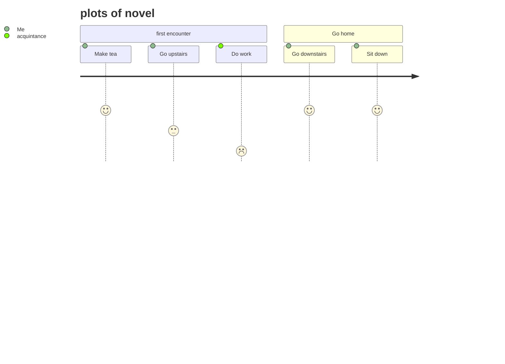

[[words#^1d808f|词表]]
>[!Tags]
> #1800s #British-literature #psytchological 

>[!perception]
and to him the meaning of an episode was not inside like a kernel but outside, ==enveloping the tale which brought it out only as a glow brings out a haze==, in the likeness of one of these misty halos that sometimes are made visible by the spectral illumination of moonshine.

>[! hints and mysteries]
Nowhere did we stop long enough to get a particularized     impression, but the general sense of ==vague and oppressive wonder grew upon me==. It was like a weary pilgrimage amongst hints for nightmares.

>[! essence of expedition ]
it was ==reckless without hardihood, greedy without audacity, and cruel without courage; there was not an atom of foresight or of serious intention in the whole batch of them, and they did not seem aware these things are wanted for the work of the world==. To tear treasure out of the bowels of the land was their desire, with no more moral purpose at the back of it than there is in burglars breaking into a safe.

>[! haze and bewilder]
There were moments when one's past came back to one, as it will sometimes when you have not a moment to spare for yourself; but it came in the shape of an unrestful and noisy dream, remembered with wonder amongst the overwhelming realities of this strange world of plants, and water, and silence. And this stillness of life did not in the least resemble a peace. It was the stillness of an implacable force brooding over an inscrutable intention.

